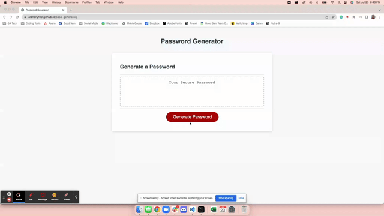

# JavaScript Challenge: Password Generator 

[](https://opensource.org/licenses/MIT)

## Description
This client has access to sensitive data and would like for me to create a password generator that uses a series of prompts that leads to a strong password that will provide the client with greater security. 

## Table of Contents 
- [User Story](#user-story)
- [Acceptance Criteria](#acceptance-criteria)
- [Technologies Used](#technologies-used)
- [Final Application](#final-application)
- [Credits](#credits)
- [License](#license)

## User Story 
```md
AS AN employee with access to sensitive data
I WANT to randomly generate a password that meets certain criteria
SO THAT I can create a strong password that provides greater security
```

## Acceptance Criteria
```md
GIVEN I need a new, secure password
WHEN I click the button to generate a password
THEN I am presented with a series of prompts for password criteria
WHEN prompted for password criteria
THEN I select which criteria to include in the password
WHEN prompted for the length of the password
THEN I choose a length of at least 8 characters and no more than 128 characters
WHEN asked for character types to include in the password
THEN I confirm whether or not to include lowercase, uppercase, numeric, and/or special characters
WHEN I answer each prompt
THEN my input should be validated and at least one character type should be selected
WHEN all prompts are answered
THEN a password is generated that matches the selected criteria
WHEN the password is generated
THEN the password is either displayed in an alert or written to the page
```
### Additional instructions:
* Application deploys at live URL with no loading errors 
* Should not produce any errors in the console when you inspect it using Chrome DevTools.
* Application user experience is intuitive and easy to navigate
* Application user interface style is clean and polished
* Application resembles the mock-up functionality in acceptance criteria 
* Repository as a unique name, has proper file structure, contains multiple descriptive commit messages, and a quality README file with description, screenshot of the final project, and a link to the live deployed application

## Technologies Used
* 
* 
* 
* 

## Final Application
[View Live Link]()


## Description and Credits 
* w3schools: I used w3schools to help me understand loops and conditions better.
* YouTube by Paul Keldsen - Web Development(https://www.youtube.com/watch?v=x4HUaiazDes&start=160): This video helped me understand the importance of Pseudocoding and help me grasped where to begin. 
* MDN Links from the JavaScript mini project: 
    - https://developer.mozilla.org/en-US/docs/Web/API/Window/alert
    - https://developer.mozilla.org/en-US/docs/Web/API/Window/confirm 
    - https://developer.mozilla.org/en-US/docs/Web/API/Window/prompt
    - https://developer.mozilla.org/en-US/docs/Web/JavaScript/Reference/Global_Objects/Math 
* I drew inspiration from a multiple activities we did during one of our lectures on JavaScript.
* I collaborated with my study group from class on loops & debugging.
* I used the following link to help me with the layout for this README file:
https://coding-boot-camp.github.io/full-stack/github/professional-readme-guide

## License 
MIT License

Copyright © 2022, Ashlynn Landry

Permission is hereby granted, free of charge, to any person obtaining a copy
of this software and associated documentation files (the "Software"), to deal
in the Software without restriction, including without limitation the rights
to use, copy, modify, merge, publish, distribute, sublicense, and/or sell
copies of the Software, and to permit persons to whom the Software is
furnished to do so, subject to the following conditions:

The above copyright notice and this permission notice shall be included in all
copies or substantial portions of the Software.

THE SOFTWARE IS PROVIDED "AS IS", WITHOUT WARRANTY OF ANY KIND, EXPRESS OR
IMPLIED, INCLUDING BUT NOT LIMITED TO THE WARRANTIES OF MERCHANTABILITY,
FITNESS FOR A PARTICULAR PURPOSE AND NONINFRINGEMENT. IN NO EVENT SHALL THE
AUTHORS OR COPYRIGHT HOLDERS BE LIABLE FOR ANY CLAIM, DAMAGES OR OTHER
LIABILITY, WHETHER IN AN ACTION OF CONTRACT, TORT OR OTHERWISE, ARISING FROM,
OUT OF OR IN CONNECTION WITH THE SOFTWARE OR THE USE OR OTHER DEALINGS IN THE
SOFTWARE.


